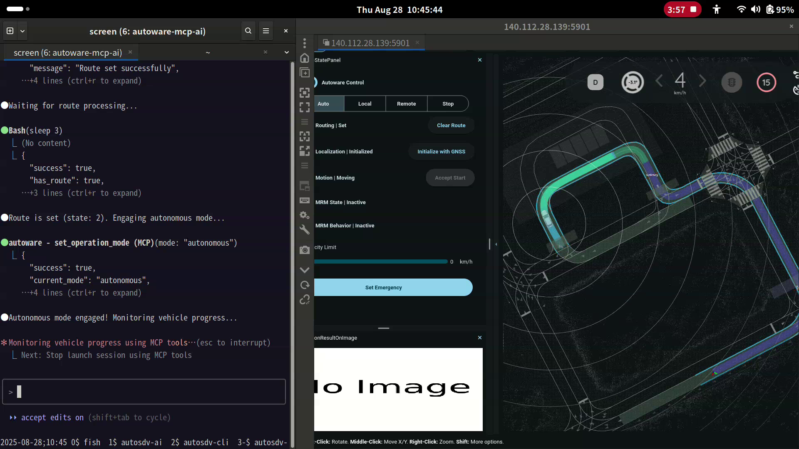

# Autoware MCP Integration

[](LICENSE)
[](https://docs.ros.org/en/humble/)
[](https://autoware.org/)

The Autoware MCP Server provides a universal bridge between ANY AI agent (Claude, GPT, Gemini, or custom agents) and the Autoware autonomous driving stack through the Model Context Protocol (MCP). This enables AI-driven mission planning, real-time vehicle control, and adaptive decision-making for autonomous vehicles.

[](media/2025-08-28_planning-simulation.mp4)

*Click the image above to watch the full autonomous driving demo*

### Key Features

- **Universal AI Support**: Works with any MCP-compatible AI agent (Claude, GPT, Gemini, etc.)
- **Full Vehicle Control**: Complete control over Autoware's autonomous driving features
- **Real-Time Monitoring**: Concurrent monitoring of perception, planning, and vehicle state
- **Launch Management**: Start, stop, and manage ROS2 launch sessions
- **Safety Systems**: Comprehensive safety validation at every level
- **Mission Execution**: Support for complex multi-step missions with waypoints

## Quick Start

### Prerequisites

- Ubuntu 22.04 LTS
- ROS2 Humble
- Python 3.10+
- Autoware 0.45.1

### Installation

```bash
# Clone the repository
git clone https://github.com/your-org/autoware-mcp.git
cd autoware-mcp

# Install uv (Python package manager)
curl -LsSf https://astral.sh/uv/install.sh | sh

# Install dependencies with uv
uv sync --all-extras --dev
```

### Basic Usage

1. **Start the MCP Server**:
```bash
# Source your ROS2/Autoware workspace
source ~/autoware/install/setup.bash

# Start the MCP server
uv run autoware-mcp
```

2. **Connect with Claude Code**:
Add to your Claude Code configuration file (`claude_desktop_config.json`):
```json
{
  "mcpServers": {
    "autoware": {
      "command": "uv",
      "args": ["run", "autoware-mcp"],
      "env": {
        "ROS_DOMAIN_ID": "your_domain_id"
      }
    }
  }
}
```

3. **Example Prompts for AI Agents**:

Since AI agents may not have specific knowledge about autonomous driving, use clear, step-by-step prompts:

**To launch a planning simulation:**
```
Please launch a planning simulation for Autoware using the MCP tools. 
Use the start_launch tool with the planning_simulation_mcp.launch.py file.
```

**To run an autonomous driving sequence:**
```
Please run the complete autonomous driving sequence:
1. Initialize the vehicle's localization at the starting position
2. Clear any existing route and set a new route to the goal position
3. Change the operation mode to autonomous
4. Monitor the vehicle's progress until it reaches the destination
5. Stop the simulation when complete
```

**To monitor vehicle state:**
```
Please check the current vehicle state including position, speed, and route status
using the get_vehicle_state and get_current_route MCP tools.
```

## Available MCP Tools

### System Management
- `health_check` - Get complete system health status
- `check_autoware_status` - Check running Autoware components
- `verify_ros2_environment` - Verify ROS2 setup

### Launch Management
- `start_launch` - Start ROS2 launch files
- `stop_launch` - Stop launch sessions
- `list_launch_sessions` - View active sessions
- `get_session_status` - Get detailed session information

### Vehicle Control
- `set_operation_mode` - Change between stop/autonomous/local/remote modes
- `initialize_localization` - Set initial vehicle pose
- `set_route` - Set route to destination
- `set_route_points` - Set route with waypoints
- `get_current_route` - Get current route status

### Vehicle Monitoring
- `get_vehicle_state` - Get vehicle position, speed, and kinematics
- `monitor_operation_mode` - Monitor current operation mode
- `monitor_localization_state` - Check localization status
- `monitor_motion_state` - Monitor motion readiness

### ROS2 Interface
- `list_ros2_nodes` - List all active ROS2 nodes
- `list_ros2_topics` - List all ROS2 topics
- `list_ros2_services` - List all ROS2 services
- `call_ros2_service` - Call any ROS2 service
- `publish_to_topic` - Publish to any ROS2 topic
- `echo_topic_messages` - Capture messages from topics

## Documentation

For comprehensive documentation, please refer to the [Developer Guide](book/)

## Configuration

Create a configuration file `config/custom.yaml`:

```yaml
mcp_server:
  host: 0.0.0.0
  port: 8080
  
autoware:
  ros_domain_id: 42
  ad_api_url: http://localhost:8888
  
safety:
  max_velocity: 50.0  # m/s
  max_acceleration: 3.0  # m/s²
  emergency_deceleration: -8.0  # m/s²
```

## Development

### Running Tests

```bash
# Unit tests
pytest tests/unit -v

# Integration tests (requires Autoware)
pytest tests/integration -v

# Simulation tests
pytest tests/simulation -v

# All tests with coverage
pytest --cov=autoware_mcp --cov-report=html
```

### Contributing

Please read [CONTRIBUTING.md](CONTRIBUTING.md) for details on our code of conduct and the process for submitting pull requests.

## Safety Notice

**WARNING**: This system is designed for research and development purposes. Always ensure:
- A safety driver is present during real vehicle testing
- Emergency stop mechanisms are properly configured
- All safety validations are enabled
- Testing is conducted in controlled environments

## Troubleshooting

### Common Issues

1. **ROS2 Connection Issues**:
```bash
export ROS_DOMAIN_ID=42
export RMW_IMPLEMENTATION=rmw_cyclonedds_cpp
```

2. **MCP Server Not Responding**:
- Check firewall settings
- Verify Autoware is running
- Check logs: `tail -f logs/mcp_server.log`

3. **Performance Issues**:
- Monitor resource usage: `htop`, `nvidia-smi`
- Check ROS2 topics: `ros2 topic hz /topic_name`
- Review latency metrics in Grafana dashboard

## License

This project is licensed under the Apache License 2.0 - see the [LICENSE](LICENSE) file for details.

## Acknowledgments

- [Autoware Foundation](https://www.autoware.org/) for the autonomous driving stack
- [Model Context Protocol](https://modelcontextprotocol.org/) contributors
- ROS2 and Open Robotics community

## Support

For issues and questions:
- GitHub Issues: [Create an issue](https://github.com/your-org/autoware-mcp/issues)
- Documentation: [Read the docs](https://your-docs-site.com)
- Community: [Join our Discord](https://discord.gg/your-invite)

## Roadmap

- [ ] Multi-vehicle coordination support
- [ ] Enhanced perception monitoring
- [ ] Cloud-based mission management
- [ ] V2X communication integration
- [ ] Advanced ML-based planning
- [ ] Simulation environment integration

---

**Note**: This project is under active development. APIs and features may change.
