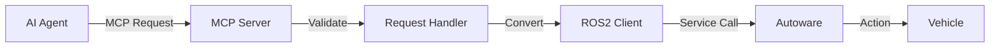
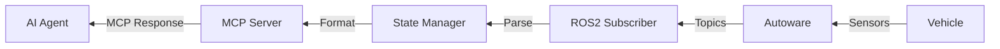

# MCP Integration

This chapter explains how the Model Context Protocol (MCP) is integrated with Autoware to enable AI-driven autonomous driving.

## Overview

The Autoware MCP Server acts as a bridge between AI agents and the Autoware autonomous driving stack, translating high-level AI commands into low-level vehicle control actions.

## Architecture Layers

### 1. MCP Protocol Layer

The top layer handles MCP protocol communication:

```
┌─────────────────────────────────────┐
│         MCP Protocol Layer          │
├─────────────────────────────────────┤
│ • Tool Registration                 │
│ • Request Validation                │
│ • Response Formatting               │
│ • Error Handling                    │
└─────────────────────────────────────┘
```

**Key Components**:
- **FastMCP Server**: Handles protocol implementation
- **Tool Registry**: Manages available MCP tools
- **Request Router**: Directs requests to handlers
- **Response Formatter**: Structures responses

### 2. Translation Layer

Converts between MCP tools and ROS2 interfaces:

```
┌─────────────────────────────────────┐
│       Translation Layer             │
├─────────────────────────────────────┤
│ • MCP → ROS2 Service Calls          │
│ • ROS2 Topics → MCP Responses       │
│ • Data Type Conversion              │
│ • State Management                  │
└─────────────────────────────────────┘
```

**Key Components**:
- **AD API Client**: Autoware AD API interface
- **ROS2 Manager**: ROS2 communication handler
- **Type Converters**: Data format translators
- **State Cache**: Performance optimization

### 3. ROS2 Interface Layer

Direct interaction with Autoware:

```
┌─────────────────────────────────────┐
│       ROS2 Interface Layer          │
├─────────────────────────────────────┤
│ • Service Clients                   │
│ • Topic Publishers/Subscribers      │
│ • Action Clients                    │
│ • Transform Listeners               │
└─────────────────────────────────────┘
```

## MCP Tools Overview

The server provides several categories of MCP tools:

### System Tools
- `health_check`: System health monitoring
- `get_system_status`: Resource usage
- `verify_ros2_environment`: Environment validation

### Vehicle Control Tools
- `set_operation_mode`: Change driving mode
- `set_route`: Plan route to destination
- `initialize_localization`: Set initial position
- `get_vehicle_state`: Current vehicle status

### Launch Management Tools
- `start_launch`: Start ROS2 launch files
- `stop_launch`: Stop launch sessions
- `get_session_status`: Monitor sessions
- `generate_launch_file`: Create launch files

### Monitoring Tools
- `monitor_diagnostics`: System diagnostics
- `monitor_motion_state`: Motion status
- `echo_topic_messages`: Topic inspection

## Data Flow

### Request Flow (AI → Vehicle)



Example:
```python
# AI sends MCP request
{
    "tool": "set_route",
    "arguments": {
        "goal_pose": {
            "position": {"x": 100, "y": 200, "z": 0},
            "orientation": {"w": 1}
        }
    }
}

# Converted to ROS2 service call
/api/routing/set_route_points
SetRoutePoints.Request(
    goal=Pose(...),
    waypoints=[]
)
```

### Response Flow (Vehicle → AI)



Example:
```python
# ROS2 topic data
/localization/kinematic_state
TwistWithCovarianceStamped(
    twist=Twist(
        linear=Vector3(x=2.5, y=0, z=0),
        angular=Vector3(x=0, y=0, z=0.1)
    )
)

# Converted to MCP response
{
    "velocity": 2.5,
    "position": {"x": 3752, "y": 73736, "z": 0},
    "heading": 1.57
}
```

## Communication Patterns

### 1. Request-Response

Synchronous operations with immediate response:

```python
# MCP Tool Call
await mcp.call_tool("get_vehicle_state")

# Internal Flow
1. MCP Server receives request
2. Calls ROS2 service: /api/vehicle/kinematics
3. Waits for response
4. Returns formatted data
```

### 2. Streaming Updates

Continuous data flow for monitoring:

```python
# MCP Subscribe
async for update in mcp.subscribe("vehicle_state"):
    print(update)

# Internal Flow
1. MCP Server creates ROS2 subscriber
2. Subscribes to /api/vehicle/kinematics
3. Streams updates to AI agent
4. Handles connection lifecycle
```

### 3. Asynchronous Actions

Long-running operations with status updates:

```python
# MCP Action
task = await mcp.start_action("drive_to_goal")
while not task.done():
    status = await task.get_status()
    await asyncio.sleep(1)

# Internal Flow
1. MCP Server initiates action
2. Creates ROS2 action client
3. Monitors action feedback
4. Reports progress to AI
```

## Type Conversions

### Geometry Types

MCP JSON ↔ ROS2 Messages:

```python
# MCP Format
{
    "position": {"x": 100, "y": 200, "z": 0},
    "orientation": {"x": 0, "y": 0, "z": 0, "w": 1}
}

# ROS2 Format
geometry_msgs.msg.Pose(
    position=Point(x=100, y=200, z=0),
    orientation=Quaternion(x=0, y=0, z=0, w=1)
)
```

### Time Handling

```python
# MCP Format (ISO 8601)
"2024-01-27T10:30:00Z"

# ROS2 Format
builtin_interfaces.msg.Time(
    sec=1706351400,
    nanosec=0
)
```

### State Enums

```python
# MCP Format (strings)
"autonomous"

# ROS2 Format (integers)
OperationModeState.AUTONOMOUS = 2
```

## Error Handling

### MCP Level Errors

```python
{
    "error": {
        "code": -32602,
        "message": "Invalid params",
        "data": {
            "field": "goal_pose",
            "reason": "Missing required field"
        }
    }
}
```

### ROS2 Service Errors

```python
# Service call failure
try:
    response = await service.call_async(request)
except ServiceException as e:
    return {
        "success": False,
        "error": f"Service call failed: {e}"
    }
```

### Recovery Strategies

1. **Retry with backoff**: Transient failures
2. **Fallback**: Alternative approaches
3. **Graceful degradation**: Reduced functionality
4. **Emergency stop**: Safety critical

## Performance Optimization

### Caching

Frequently accessed data is cached:

```python
class StateCache:
    def __init__(self, ttl=0.1):  # 100ms TTL
        self._cache = {}
        self._timestamps = {}
    
    async def get_vehicle_state(self):
        if self._is_fresh("vehicle_state"):
            return self._cache["vehicle_state"]
        
        # Fetch fresh data
        state = await self._fetch_vehicle_state()
        self._cache["vehicle_state"] = state
        self._timestamps["vehicle_state"] = time.time()
        return state
```

### Batching

Multiple operations combined:

```python
# Instead of multiple calls
await set_initial_pose(pose)
await clear_route()
await set_route(goal)

# Batch operation
await initialize_and_route(pose, goal)
```

### Connection Pooling

Reuse ROS2 connections:

```python
class ServicePool:
    def __init__(self):
        self._clients = {}
    
    def get_client(self, service_name):
        if service_name not in self._clients:
            self._clients[service_name] = self.node.create_client(...)
        return self._clients[service_name]
```

## Security Considerations

### Input Validation

All MCP inputs are validated:

```python
def validate_pose(pose):
    required = ["position", "orientation"]
    for field in required:
        if field not in pose:
            raise ValueError(f"Missing {field}")
    
    # Range checks
    if abs(pose["position"]["x"]) > 10000:
        raise ValueError("Position out of bounds")
```

### Rate Limiting

Prevent resource exhaustion:

```python
@rate_limit(calls=10, period=1.0)  # 10 calls/second
async def set_route(goal_pose):
    # Implementation
```

### Authorization

Future support for authorization:

```python
@require_auth(level="operator")
async def set_operation_mode(mode):
    # Only authorized users can change mode
```

## Testing MCP Integration

### Unit Tests

Test individual components:

```python
async def test_pose_conversion():
    mcp_pose = {"position": {"x": 1, "y": 2, "z": 3}}
    ros_pose = convert_to_ros_pose(mcp_pose)
    assert ros_pose.position.x == 1
```

### Integration Tests

Test full request flow:

```python
async def test_set_route():
    # Start MCP server
    server = await start_mcp_server()
    
    # Send MCP request
    response = await server.call_tool("set_route", goal_pose)
    
    # Verify ROS2 service was called
    assert mock_service.called
    assert response["success"]
```

### End-to-End Tests

Test with real Autoware:

```python
async def test_autonomous_driving():
    # Start simulation
    await start_simulation()
    
    # Execute mission via MCP
    await mcp.call_tool("initialize_localization", pose)
    await mcp.call_tool("set_route", goal)
    await mcp.call_tool("set_operation_mode", "autonomous")
    
    # Verify arrival
    await wait_for_arrival()
```

## Best Practices

1. **Always validate inputs** before forwarding to ROS2
2. **Handle timeouts** gracefully with appropriate defaults
3. **Log all operations** for debugging and audit
4. **Monitor performance** metrics and optimize bottlenecks
5. **Implement circuit breakers** for failing services
6. **Use structured logging** for better observability
7. **Document tool contracts** clearly
8. **Version API changes** carefully

## Next Steps

- Learn about [Components](./components.md) in detail
- Explore [Safety & Monitoring](./safety-monitoring.md)
- See [API Reference](../developer/api-reference.md) for tools
- Try [Examples](../user-guide/autonomous-driving.md)