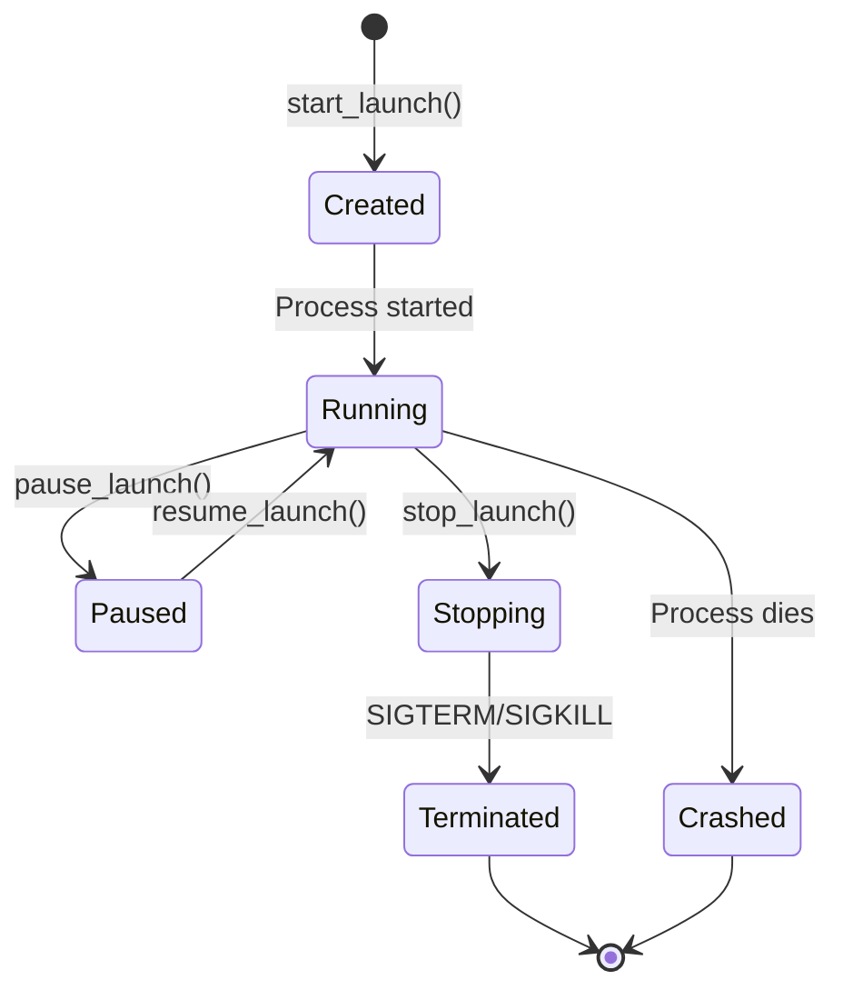

# Session Management

## Overview

Launch session management ensures reliable process control with no orphaned processes, even after MCP server crashes.

## Key Design Decisions

### Process Group Management
- Each launch creates a new process group (PGID)
- All child processes inherit the PGID
- Termination signals sent to entire group
- Ensures complete cleanup

### State Persistence
```
.autoware-mcp/
└── instance_<port>_<pid>/
    └── sessions/
        └── <session_id>/
            ├── session.pid   # Main process PID
            ├── session.pgid  # Process group ID
            └── state.json    # Session metadata
```

### Session Lifecycle



## Implementation Details

### Session Creation
1. Generate UUID for session
2. Start process with `setsid()` for new PGID
3. Write PID/PGID files atomically
4. Monitor process state

### Graceful Shutdown
1. Send SIGTERM to process group
2. Wait for timeout (default 10s)
3. Send SIGKILL if still running
4. Clean up tracking files

### Orphan Detection
1. Scan all instance directories
2. Check if MCP server PID exists
3. Terminate orphaned sessions
4. Archive to `archived/` directory

## Error Recovery

### MCP Server Crash
- Sessions continue running
- On restart, detect orphans
- User can stop/restart sessions

### Launch Process Crash
- Detected via process polling
- State updated to "crashed"
- Logs preserved for debugging

### Network Interruption
- Sessions unaffected
- State persists on disk
- Reconnection restores control

## Best Practices

### Resource Limits
- Max 100 concurrent sessions
- Log rotation at 100MB
- Automatic cleanup after 24 hours

### Monitoring
- Poll process state every 2 seconds
- Check child process count
- Monitor resource usage

### Security
- No elevated privileges
- User-space process management
- Command injection prevention