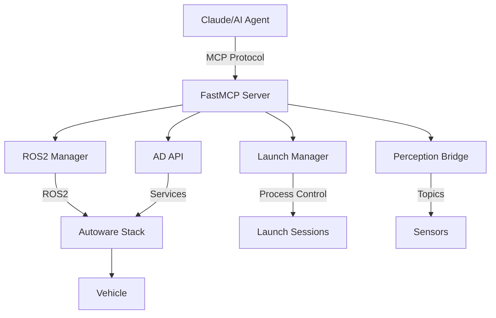

# Server Architecture

## System Overview

## Core Architecture Principles

### 1. Stateless Tools
- Each MCP tool is stateless and atomic
- State managed by Autoware and ROS2
- Session state persists across MCP restarts

### 2. Process Isolation
- Launch sessions run in separate process groups
- PID/PGID tracking prevents orphans
- Clean termination on server shutdown

### 3. Async Operations
- All I/O operations are async
- Non-blocking ROS2 interactions
- Concurrent tool execution support

## Component Interactions

### FastMCP Server
- Handles MCP protocol communication
- Routes tool calls to appropriate handlers
- Manages request/response lifecycle

### ROS2 Manager
- Singleton instance for ROS2 operations
- Caches node and topic information
- Executes ROS2 CLI commands safely

### AD API Interface
- High-level Autoware operations
- Abstracts complex service sequences
- Provides unified response models

### Launch Manager
- Tracks all launch sessions
- Manages process lifecycles
- Generates launch files programmatically

### Perception Bridge
- Converts sensor data to AI-readable formats
- Generates visualizations
- Provides object detection interface

## Error Handling

### Graceful Degradation
- Missing topics return empty data
- Service failures include error details
- Partial failures reported accurately

### Resource Cleanup
- Automatic session cleanup on exit
- Orphan process detection
- Temporary file management

## Security Considerations

### Process Isolation
- Launch sessions run with user permissions
- No elevated privileges required
- Command injection prevention

### Input Validation
- All tool inputs validated with Pydantic
- Path traversal protection
- Command sanitization